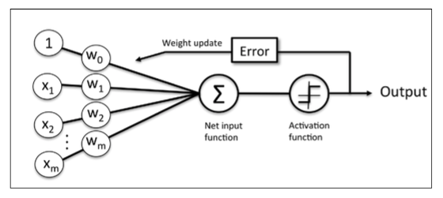
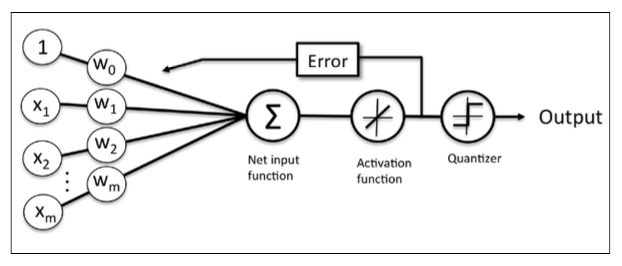
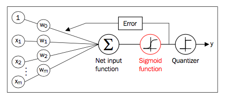

## Machine Learning Basics
This project will focus on some machine learning basic problems, including classification, regression, clustering, etc. Some commonly used methods will be explained and implemented for study.

## Binary Classification

#### Perceptron
* Structure

* Denotion
We denote $$x^{(i)}$$ for a sample, and $x_i$ for a feature, same rules for $y$.
So we have, $x^{(i)} \in R^{m}, y^{(i)} \in R, w \in R^{m}, b \in R$

* Activation Function
$$y^{(i)} = sign(wx^{(i)} + b)$$

* Loss Function
$L = \sum_{x^{(i)} \in M}-y^{(i)}(wx^{(i)} + b)$

* Update Rules
Let's first compute the partial derivertive of loss function.
$\nabla_w L(w,b) = -\sum_{x^{(i)} \in M} y^{(i)} x^{(i)}$
$\nabla_b L(w,b) = -\sum_{x^{(i)} \in M} y^{(i)}$,
Then update $w$ and $b$,
$w \leftarrow w + \eta y^{(i)}x^{(i)}$
$b \leftarrow b + \eta y^{(i)}$
In the above figure, we can avoid computing $\nabla_b L(w,b)$ if $x$ is denoted as:
$x^{(i)} = [1, x_1, x_2, ..., x_m]$

#### Adaline
* Structure

#### Logistic Regression
* Structure

To be continued...
